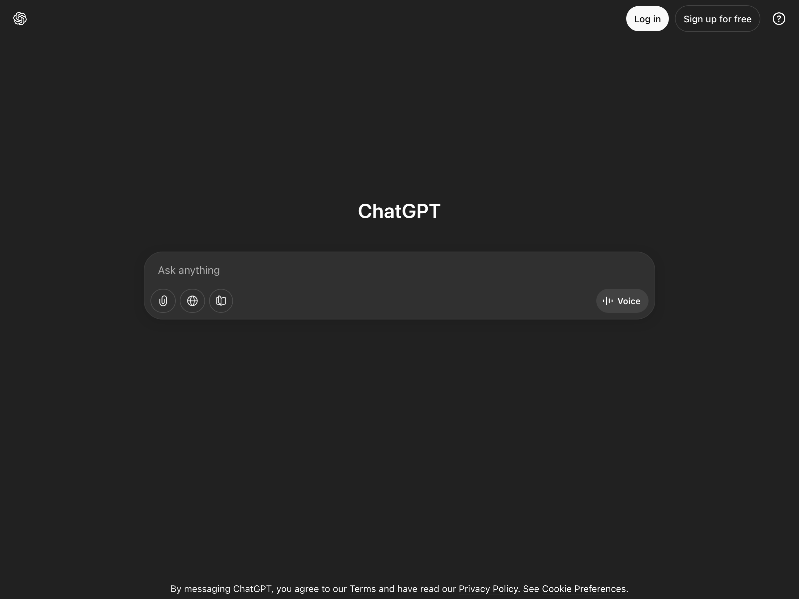
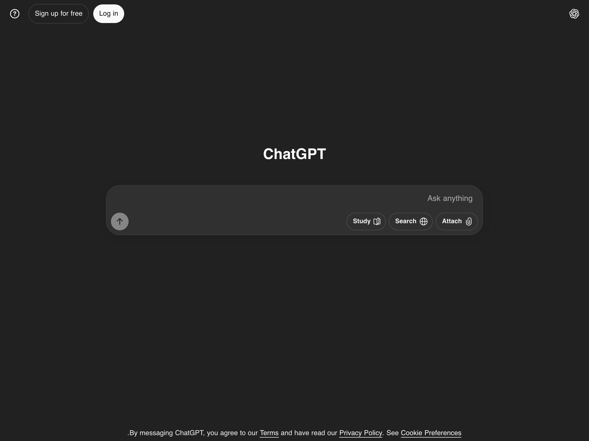

# RTL in Web

A simple Firefox add-on that forces **ChatGPT** and **deepSeek** interface to display in **Persian (fa-IR)** with **right-to-left (RTL)** layout.  
This add-on is designed for Persian users who want ChatGPT to look more natural in their language.

---

## Features

- Automatically sets `<html dir="rtl" lang="fa-IR">`.
- Applies a custom Persian font (Vazirmatn, designed by Saber Rasti Kerdar) for better readability.
- Lightweight, runs only on target website.
- Open Source (GPL v2).

---

## Installation

1. Download the add-on from [Firefox Add-ons (AMO)](https://addons.mozilla.org/addon/rtl-in-web/).
2. Install it in your browser.
3. Open [ChatGPT](https://chat.openai.com/) or [deepSeek](https://deepseek.com) → the page will automatically switch to RTL and Persian.

---

## Source Code

The full source code is available on GitHub:  
[github.com/jalalbagheri95/rtl-in-web](https://github.com/jalalbagheri95/rtl-in-web)

---

## Development

To test locally before publishing:

1. Download the add-on from [github](https://github.com/jalalbagheri95/rtl-in-web)
2. Open **Firefox** and go to `about:debugging#/runtime/this-firefox`.
3. Click **Load Temporary Add-on**.
4. Select the `manifest.json` file from this project.
5. Open target site and test the RTL layout.

---

## License

This project is licensed under **GPL v2**.  
Font Software is licensed under the SIL Open Font License, Version 1.1. See [OFL.txt](/OFL.txt).

---

## Screenshots

### Before

### After

---

## Change log

### version 1.3

- change add-on name
- add deepseek to target sites
- fix pre stlye
